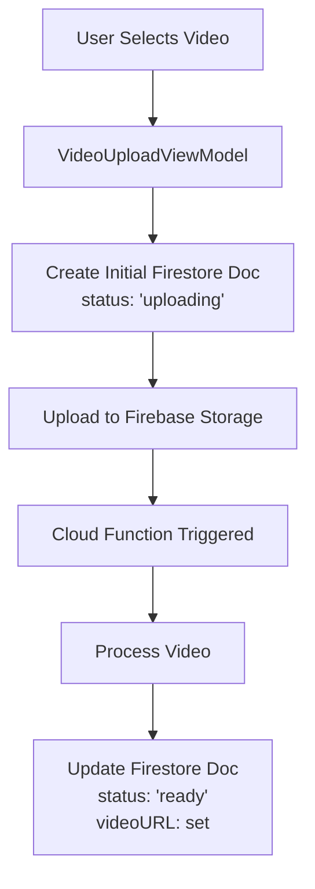

# Video Processing Troubleshooting Guide

## Overview

Some videos in the feed are displaying only a loading spinner. This occurs because these videos have not completed processing. Their Firestore documents show a `processingStatus` of `"uploading"` and do not have a valid `videoURL`. The VideoPlayerViewModel checks these fields before attempting to set up an AVPlayer; if the video is not ready (i.e., if `processingStatus` is not `"ready"` or `videoURL` is empty), the UI continues to show a loading spinner.

## System Architecture

### 1. Upload Flow


### 2. Key Components

#### Client-Side (Swift)
- `VideoUploadViewModel`: Handles video selection and initial upload
- `VideoProcessingService`: Manages the video processing pipeline
- `VideoPlayerViewModel`: Controls video playback and UI state
- `Video` model: Contains `processingStatus` enum and video metadata

#### Server-Side (Firebase)
- Cloud Function: `processVideo` (triggered on video upload)
- Firebase Storage: Stores video files
- Firestore: Stores video metadata and processing status

## Issue Analysis

The loading spinner appears because:
1. The video documents have `processingStatus: "uploading"`
2. The `videoURL` fields are empty
3. `VideoPlayerViewModel` enforces these checks in `setupPlayer()`

## Detailed Processing Flow

1. **Initial Upload (`VideoUploadViewModel`)**
   ```swift
   // Creates initial document with:
   processingStatus: .uploading
   videoURL: ""
   ```

2. **Cloud Function Trigger (`processVideo`)**
   ```javascript
   exports.processVideo = onObjectFinalized({
     // Triggered when video upload completes
     // Updates status to "processing"
     // Processes video
     // Sets status to "ready" when done
   });
   ```

3. **Client-Side Status Monitoring**
   ```swift
   // VideoPlayerViewModel monitors status:
   if video.processingStatus != .ready || video.videoURL.isEmpty {
       // Shows spinner
       return
   }
   ```

## Troubleshooting Steps

1. **Verify Firestore Documents**
   - Check the affected video documents in Firestore
   - Expected fields:
     ```javascript
     {
       id: string,
       processingStatus: "uploading" | "ready" | "error",
       videoURL: string,
       // ... other fields
     }
     ```

2. **Check Cloud Function Logs**
   ```bash
   firebase functions:log
   ```
   Look for:
   - Function trigger events
   - Processing status updates
   - Error messages

3. **Monitor Processing Status**
   - Use Firebase Console
   - Navigate to Functions > Logs
   - Filter for `processVideo` function
   - Check for completion or errors

4. **Verify Storage Files**
   - Check Firebase Storage
   - Verify video files exist in correct path
   - Check file permissions

5. **Debug Client-Side**
   ```swift
   // Add logging in VideoPlayerViewModel:
   LoggingService.debug("Video status: \(video.processingStatus.rawValue)")
   LoggingService.debug("Video URL: \(video.videoURL)")
   ```

## Common Issues and Solutions

1. **Stuck in "uploading" Status**
   - **Cause**: Cloud Function not triggered or failed
   - **Fix**: Check Cloud Function logs and redeploy if needed

2. **Missing videoURL**
   - **Cause**: Processing completed but URL not updated
   - **Fix**: Verify Cloud Function updates document correctly

3. **Processing Errors**
   - **Cause**: Video processing failed
   - **Fix**: Check error logs and retry processing

4. **Permission Issues**
   - **Cause**: Storage or Firestore permissions
   - **Fix**: Verify security rules

## Resolution Steps

1. **Check Current Status**
   ```javascript
   // In Firebase Console
   db.collection('videos')
     .where('processingStatus', '==', 'uploading')
     .get()
   ```

2. **Force Process if Needed**
   ```javascript
   // Update status to trigger reprocessing
   await admin.firestore()
     .collection('videos')
     .doc(videoId)
     .update({
       processingStatus: 'uploading'
     });
   ```

3. **Monitor Progress**
   - Watch Cloud Function logs
   - Check Firestore document updates
   - Verify client-side status changes

## Prevention

1. **Add Timeouts**
   ```swift
   // In VideoPlayerViewModel
   private func setupProcessingStatusListener() {
       // Add timeout after X minutes
       // Show error if processing takes too long
   }
   ```

2. **Implement Retry Logic**
   ```javascript
   // In Cloud Function
   exports.processVideo = onObjectFinalized({
     // Add retry mechanism for failed processing
   });
   ```

3. **Enhanced Monitoring**
   - Add detailed logging
   - Set up alerts for failed processing
   - Monitor processing times

## Support

For additional assistance:
1. Check Firebase Function logs
2. Review client-side logs
3. Contact system administrator for manual intervention

Remember to always check the Cloud Function logs first, as they provide the most detailed information about the video processing pipeline. 